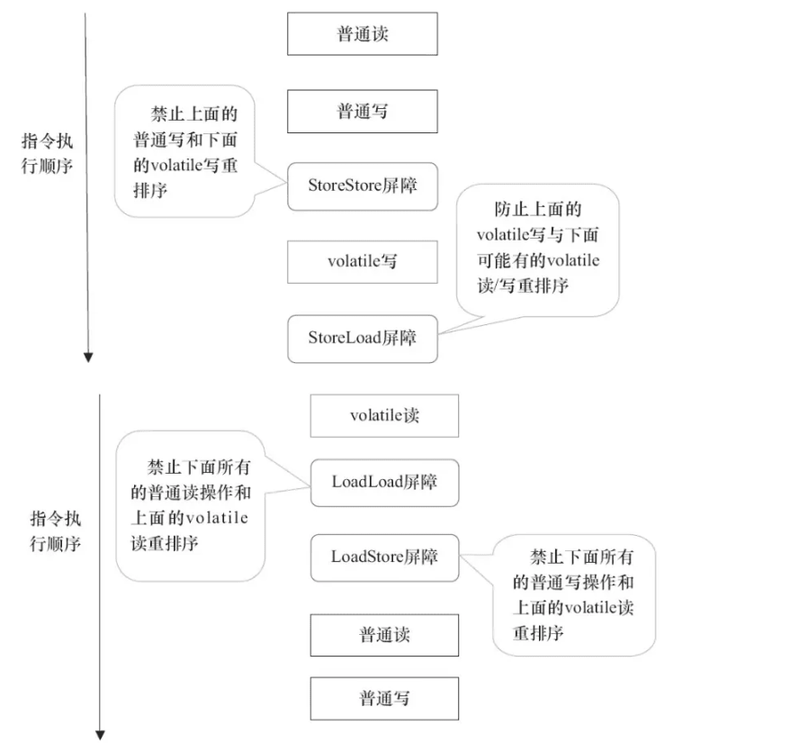

## JUC

不同设别的速度差异

* CPU增加缓存，均衡与内存的速度差异     ===> 可见性问题
* 操作系统增加了进程、线程、分时复用CPU，均衡CPU和IO设备问题     ===> 原子性问题
* 编译程序优化指令执行顺序     ====> 有序性问题

**可见性**：一个线程对共享变量的修改，另一个线程不能立即看到

**原子性**：一个操作或者多个操作 在执行过程中不能被打断

**有序性**：程序执行是按照一定的先后顺序

在基本数据类型的变量**读取和赋值**都是原子性操作。变量被volatile修饰时，保证修改的值立即被更新到主存（普通变量写入主存的时候是不确定的）。

另外，通过synchronized和Lock也能够保证可见性，synchronized和Lock能保证同一时刻只有一个线程获取锁然后执行同步代码，并且在释放锁之前会将对变量的修改刷新到主存当中。

#### Happens-Before 原则

unlock操作先发生于lock操作。
		被volatile修饰变量的写操作先发生于读操作
		对象中的start方法最先执行
		Thread对象的结束先发生于join()方法
		interrupt()方法调用先发生于中断事件发生
		对象初始化（构造函数完成）先于它的finalize()方法

#### 线程安全

一个类可以被多个线程安全调用

**不可变**：不会被改变的对象

**绝对线程安全**：在任何环境下，都无需采取同步措施

**相对线程安全**：对对象单独操作是安全的。

**线程兼容**：对象本身不是线程安全的，可以通过一些操作保证对象在并发环境下安全使用。

**线程对立**：无论采取什么措施，线程都无法并发执行

**Executor**: 管理多个异步任务的执行

**Daemon**：程序运行时在后台提供服务的进程

**yield**： 当前线程已经完成了生命周期中最重要的部分，可以切换给其他线程执行。

**InterruptedException**: 调用线程的interrupt()方法中断线程，如果线程处于阻塞、期限等待或无限等待状态就会抛出IntteruptedException异常，提前结束进程。

**interrupted**： 线程run执行一个死循环，并且没有中断等操作抛出InterruptedException操作，那么调用interrupt方法就无法结束线程。

调用 Executor 的 shutdown() 方法会等待线程都执行完毕之后再关闭，但是如果调用的是 shutdownNow() 方法，则相当于调用每个线程的 interrupt() 方法。

**ReentrantLock** JDK实现

~~~
public class LockExample{
	private Lock lock = new ReentrantLock();
	
	public void fun(){
		lock.lock(); 	//上锁
		try{
			System.out.println("hello");
		}finally{
			lock.unlock();	//解锁
		}
	}
}
~~~

当持有锁的线程长期不是放锁的时候。synchronized 无法中断

**公平锁**：多个线程在等待同一个锁的时候，必须按照申请锁的时间依次获得。sychronized是非公平的，ReentrantLock默认情况是非公平的，可以实现公平

ReentrantLock可以同时绑定多个Condition对象。

非公平锁是多个线程加锁时直接尝试获取锁，获取不到才会到等待队列的队尾等待。但如果此时锁刚好可用，那么这个线程可以无需阻塞直接获取到锁

**使用选择**

 除非需要使用 ReentrantLock 的高级功能，否则优先使用 synchronized。这是因为 synchronized 是 JVM 实现的一种锁机制，JVM 原生地支持它，而 ReentrantLock 不是所有的 JDK 版本都支持。并且使用 synchronized 不用担心没有释放锁而导致死锁问题，因为 JVM 会确保锁的释放。

在线程中调用另一个线程的 join() 方法，会将当前线程挂起，而不是忙等待，直到目标线程结束。

调用 wait() 使得线程等待某个条件满足，线程在等待时会被挂起，当其他线程的运行使得这个条件满足时，其它线程会调用 notify() 或者 notifyAll() 来唤醒挂起的线程。

它们都属于 Object 的一部分，而不属于 Thread。

可以在 Condition 上调用 await() 方法使线程等待，其它线程调用 signal() 或 signalAll() 方法唤醒等待的线程。相比于 wait() 这种等待方式，await() 可以指定等待的条件，因此更加灵活。
signal会从阻塞队列唤醒一个线程，该线程重新获得锁。

#### 悲观锁

乐观锁认为自己在使用数据时不会有别的线程修改数据，所以不会添加锁，只是在更新数据的时候去判断之前有没有别的线程更新了这个数据。
	悲观锁适合写操作多，乐观锁适合读操作多

让线程自旋而不要进入阻塞态

**可重入锁**： 同一个线程在外层方法获取锁的时候，再进入该线程的内层方法就会自动获得锁，不会因为之前已经获得没释放而阻塞。

~~~
public class Widget {
    public synchronized void doSomething() {
        System.out.println("方法1执行...");
        doOthers();
    }

    public synchronized void doOthers() {
        System.out.println("方法2执行...");
    }
}

~~~

类中的两个方法都是被内置锁synchronized修饰的，doSomething()方法中调用doOthers()方法。因为内置锁是可重入的，所以同一个线程在调用doOthers()时可以直接获得当前对象的锁，进入doOthers()进行操作。

**独享锁也叫排他锁**，是指该锁一次只能被一个线程所持有。如果线程T对数据A加上排它锁后，则其他线程不能再对A加任何类型的锁。

**共享锁**是指该锁可被多个线程所持有。如果线程T对数据A加上共享锁后，则其他线程只能对A再加共享锁，不能加排它锁。获得共享锁的线程只能读数据，不能修改数据。

**volatile** 是保证每次操作具备原子性，基于内存屏障实现（告诉CPU不管什么指令都无法对其进行重排）

如果对声明了 volatile 的变量进行写操作，JVM 就会向处理器发送一条 lock 前缀的指令，将这个变量所在缓存行的数据写回到系统内存,使得其他CPU缓存地址无效。

为了保证各个处理器的缓存是一致的，实现了缓存一致性协议(MESI)，每个处理器通过嗅探在总线上传播的数据来检查自己缓存的值是不是过期了，当处理器发现自己缓存行对应的内存地址被修改，就会将当前处理器的缓存行设置成无效状态，当处理器对这个数据进行修改操作的时候，会重新从系统内存中把数据读到处理器缓存里。

所有多核处理器下还会完成：当处理器发现本地缓存失效后，就会从内存中重读该变量数据，即可以获取当前最新值。

- 在每个 volatile 写操作的前面插入一个 StoreStore 屏障。
- 在每个 volatile 写操作的后面插入一个 StoreLoad 屏障。
- 在每个 volatile 读操作的后面插入一个 LoadLoad 屏障。
- 在每个 volatile 读操作的后面插入一个 LoadStore 屏障。

StoreStore:禁止上面普通写和下面volatile写 重排序

StoreLoad：防止上面的volatile写与下面可能有的volatile读/写 重排序

LoadLoad：禁止下面所有的普通读操作和上面的volatile读 重排序

LoadStore：禁止下面所有的普通写操作和上面的volatile读 重排序

