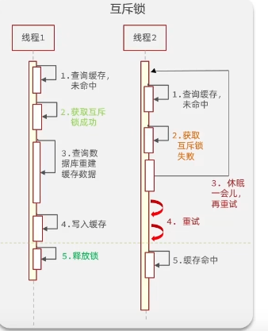
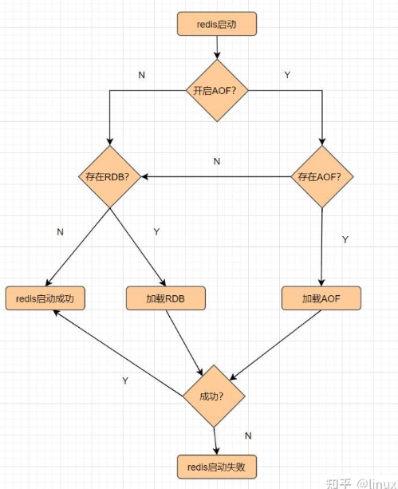
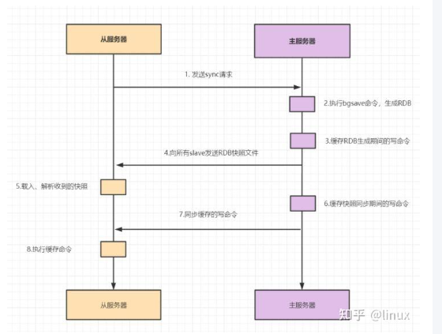
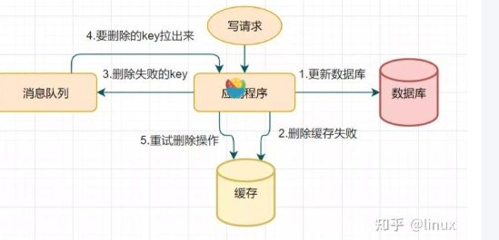
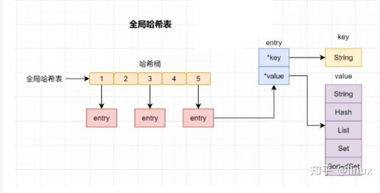
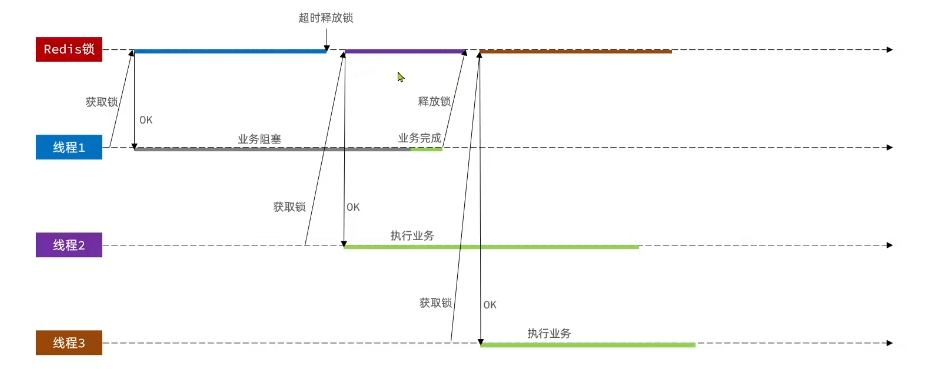
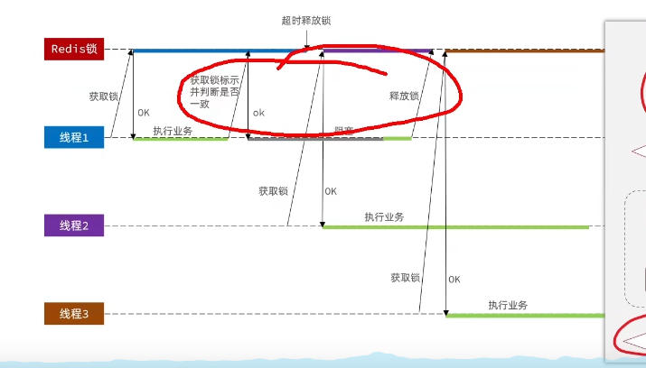

#### Restful

json数据传输。每种服务（文本、图片、视频）都有一个唯一的uri（标识符地址）

随着业务增加，需要对完整的业务进行拆分

断路保护：Sentinel

远程调用：Dubbo

分布式事务：SEATA

#### Redis

**I/O多路复用**：用一个线程去监视多个文件句柄

**虚拟内存**：自行构建VM机制，不请求系统做内存调用（暂时把不经常访问的数据【冷数据】从内存交换到磁盘，流出空间用于需要访问的数据【热数据】）

**缓存穿透**：查询一个不存在的数据，也会导致每次请求到数据库中进行查找增加数据库压力。

~~~
// 简单的缓冲穿透
 public Result queryById(Long id) {
        // 1. 从Redis中查询商铺缓存
        String shopJson = stringRedisTemplate.opsForValue().get(RedisConstants.CACHE_SHOP_KEY + id);

        // 2. 判断是否存在 存在直接返回
        if(StrUtil.isNotBlank(shopJson)){  // 判断的逻辑是shopJson不为null 且 不是空字符串
            Shop shop = JSONUtil.toBean(shopJson, Shop.class);
            return Result.ok(shop);
        }
        if (shopJson != null) {  
            // 说明命中的是空值 “” redis当中有数据
            return Result.fail("商铺不存在");
        }
        // 3. 不存在，存在两种情况 数据库可能存在 也可能不存在
        Shop shop = getById(id);
        // 4. 判断数据库中是否存在
        if (shop == null) {
            // 4.1 不存在，返回错误
            stringRedisTemplate.opsForValue().set(RedisConstants.CACHE_SHOP_KEY + id,"",RedisConstants.CACHE_SHOP_TTL,TimeUnit.MINUTES);
            return Result.fail("商铺不存在");
        }
        // 5 存在，刷新缓存
        stringRedisTemplate.expire(RedisConstants.CACHE_SHOP_KEY + id,RedisConstants.CACHE_SHOP_TTL,java.util.concurrent.TimeUnit.MINUTES);
        return Result.ok(shop);
    }
~~~

**如何避免缓存穿透**：

* 非法请求，在API层对参数进行校验，过滤非法值
* 查询数据库为空，给缓存设置一个空值，当写入请求发出，更新缓存内容。设置缓存过期时间（代码是这种实现）
* 布隆过滤器快速查找数据是否存在，存在才继续查找（它由初始值为0的位图数组和N个哈希函数组成。一个对一个key进行N个hash算法获取N个值，在比特数组中将这N个值散列后设定为1，然后查的时候如果特定的这几个位置都为1，那么布隆过滤器判断该key存在）（**还不太懂**）

**缓存雪崩**：缓存中的大量数据到达过期时间，同时访问查询数据库。（可以设置数据的过期时间有一个较大的固定值+一个较小的随机偏移量）（这个我可以实现）

利用Redis集群提高服务可用性

给缓存添加降级限流策略

给业务添加多级缓存

~~~
~~~

**缓存击穿**：某一个**高度访问**key在快过期的时候，恰好有大量并发的key对数据库访问。
		使用互斥锁方案：缓存失效时，不是立即去加载db数据，而是先使用某些带成功返回的原子操作命令，如(Redis的setnx）去操作，成功的时候，再去加载db数据库数据和设置缓存。否则就去重试获取缓存。

“永不过期”：是指没有设置过期时间，但是热点数据快要过期时，异步线程去更新和设置过期时间。

  **如何解决热key问题**：Redis集群扩容，增加分片副本（在主节点上写入数据后，从节点可以提供只读访问，将读取请求分发到多个副本，从而降低主节点的压力。），均衡读流量 。使用二级缓存，即JVM本地缓存,减少Redis的读请求。

**Redis过期策略问题**

* 定时过期：每个key单独设置一个计时器
* 惰性过期：当访问key时，才会判断key是否过期，这样内存中就存在大量key占用内存
* 定期清理：每个一段时间扫描所有key，清理过期的key

redis清理测量：每个一段时间，抽取一定数量的key检查，并且采用惰性过期，获取到某个key的时候，redis进行检查。

**Redis内存淘汰测量**

* volatile-lru：当内存不足以容纳新写入数据时，从设置了过期时间的key中使用LRU（最近最少使用）算法进行淘汰；
* allkeys-lru：当内存不足以容纳新写入数据时，从所有key中使用LRU（最近最少使用）算法进行淘汰。
* volatile-lfu：4.0版本新增，当内存不足以容纳新写入数据时，在过期的key中，使用LFU算法进行删除key。
* allkeys-lfu：4.0版本新增，当内存不足以容纳新写入数据时，从所有key中使用LFU算法进行淘汰；
* volatile-random：当内存不足以容纳新写入数据时，从设置了过期时间的key中，随机淘汰数据；。
* allkeys-random：当内存不足以容纳新写入数据时，从所有key中随机淘汰数据。
* volatile-ttl：当内存不足以容纳新写入数据时，在设置了过期时间的key中，根据过期时间进行淘汰，越早过期的优先被淘汰；
* noeviction：默认策略，当内存不足以容纳新写入数据时，新写入操作会报错。

应用：缓存，排行榜（zset数据类型）计数器应用，共享Session（对Session进行集中管理）、分布式锁、社交网络、消息队列、位操作（想记录 **user_id = 1002323 在线**，
就是在这个“数组”的第 **1002323 位**上设置为 1。

- Redis 的一个字符串（String 类型）可以存放多达 **512MB** 数据；
- 每个字节有 8 个 bit；
- 因此最多可以表示 **约 42 亿个二进制状态（2³² bit）**。

**RDB**（快照）：指定时间间隔内，执行指定次数的写操作，井内存数据快照写入磁盘。执行完操作后，在指定目录生成一个dump.rdb 文件来恢复数据。 适合大规模数据恢复

**AOF**：利用日志的形式来记录每个写操作，追加到文件中，重启时重新执行AOF文件中命令恢复数据。

**混合持久化**：结合RDB快照和AOF日志。在AOF文件中嵌入RDB快照数据，重写生成的AOF文件。

**Redis主从模式**：主节点负责读写操作和数据存储，从节点负责读操作和故障转移。

**全量复制**：slave第一次启动连接master

**哨兵模式**：Sentinel系统节点监视所有的主从节点，当主节点下线时，自动将其属下从节点升级为新的主节点。

- 发送命令，等待Redis服务器（包括主服务器和从服务器）返回监控其运行状态；
- 哨兵监测到主节点宕机，会自动将从节点切换成主节点，然后通过发布订阅模式通知其他的从节点，修改配置文件，让它们切换主机；
- 哨兵之间还会相互监控，从而达到高可用。

假设主服务器宕机，哨兵1先检测到这个结果，系统并不会马上进行 failover 过程，仅仅是哨兵1主观的认为主服务器不可用，这个现象成为**主观下线**。当后面的哨兵也检测到主服务器不可用，并且数量达到一定值时，那么哨兵之间就会进行一次投票，投票的结果由一个哨兵发起，进行 failover 操作（**客观下线**）。切换成功后，就会通过发布订阅模式，让各个哨兵把自己监控的从服务器实现切换主机，这个过程称为客观下线。这样对于客户端而言，一切都是透明的。

哨兵的工作模式如下：

1. 每个Sentinel以每秒钟一次的频率向它所知的Master，Slave以及其他Sentinel实例发送一个 PING命令。
2. 如果一个实例（instance）距离最后一次有效回复 PING 命令的时间超过 down-after-milliseconds 选项所指定的值， 则这个实例会被 Sentinel标记为主观下线。
3. 如果一个Master被标记为主观下线，则正在监视这个Master的所有 Sentinel 要以每秒一次的频率确认Master的确进入了主观下线状态。
4. 当有足够数量的 Sentinel（大于等于配置文件指定的值）在指定的时间范围内确认Master的确进入了主观下线状态， 则Master会被标记为客观下线。
5. 在一般情况下， 每个 Sentinel 会以每10秒一次的频率向它已知的所有Master，Slave发送 INFO 命令。
6. 当Master被 Sentinel 标记为客观下线时，Sentinel 向下线的 Master 的所有 Slave 发送 INFO 命令的频率会从 10 秒一次改为每秒一次
7. 若没有足够数量的 Sentinel同意Master已经下线， Master的客观下线状态就会被移除；若Master 重新向 Sentinel 的 PING 命令返回有效回复， Master 的主观下线状态就会被移除。

**Cluster集群模式**：

- meet消息：通知新节点加入。消息发送者通知接收者加入到当前集群，meet消息通信正常完成后，接收节点会加入到集群中并进行周期性的ping、pong消息交换。
- ping消息：集群内交换最频繁的消息，集群内每个节点每秒向多个其他节点发送ping消息，用于检测节点是否在线和交换彼此状态信息。
- pong消息：当接收到ping、meet消息时，作为响应消息回复给发送方确认消息正常通信。pong消息内部封装了自身状态数据。节点也可以向集群内广播自身的pong消息来通知整个集群对自身状态进行更新。
- fail消息：当节点判定集群内另一个节点下线时，会向集群内广播一个fail消息，其他节点接收到fail消息之后把对应节点更新为下线状态。

**插槽算法**把整个数据库被分为16384个slot（槽），每个进入Redis的键值对，根据key进行散列，分配到这16384插槽中的一个。使用的哈希映射也比较简单，用CRC16算法[计算](https://link.zhihu.com/?target=https%3A//activity.huaweicloud.com/free_test/index.html%3Futm_source%3Dhwc-csdn%26utm_medium%3Dshare-op%26utm_campaign%3D%26utm_content%3D%26utm_term%3D%26utm_adplace%3DAdPlace070851)出一个16 位的值，再对16384取模。数据库中的每个键都属于这16384个槽的其中一个，集群中的每个节点都可以处理这16384个槽。

集群中的每个节点负责一部分的hash槽，比如当前集群有A、B、C个节点，每个节点上的哈希槽数 =16384/3，那么就有：

- 节点A负责0~5460号哈希槽
- 节点B负责5461~10922号哈希槽
- 节点C负责10923~16383号哈希槽

**故障转移**：

1. 从节点发现自己的主节点进入客观下线状态
2. 从节点计算自己的选举优先级（根据复制偏移量和`replica-priority`配置）
3. 从节点等待随机时间后发起选举（偏移量越大，延迟越小）
4. 获得多数主节点投票的从节点成为新主节点
5. 新主节点更新集群状态，接管原主节点的槽位
6. 其他从节点开始复制新主节点的数据

**故障恢复**：

1. 资格检查：检查从节点是否具备替换故障主节点的条件。

2. 准备选举时间：资格检查通过后，更新触发故障选举时间。

3. 发起选举：到了故障选举时间，进行选举。

4. 选举投票：只有持有槽的**主节点**才有票，从节点收集到足够的选票（大于一半），触发**替换主节点操作**

**集群扩容和在线迁移**：

 	核心是槽位的在线迁移

**分布式锁**：分布式系统控制不同进程访问共享资源

**RedLock**的实现步骤:如下

- 1.获取当前时间，以毫秒为单位。
- 2.按顺序向5个master节点请求加锁。客户端设置[网络](https://link.zhihu.com/?target=https%3A//activity.huaweicloud.com/free_test/index.html%3Futm_source%3Dhwc-csdn%26utm_medium%3Dshare-op%26utm_campaign%3D%26utm_content%3D%26utm_term%3D%26utm_adplace%3DAdPlace070851)连接和响应超时时间，并且超时时间要小于锁的失效时间。（假设锁自动失效时间为10秒，则超时时间一般在5-50毫秒之间,我们就假设超时时间是50ms吧）。如果超时，跳过该master节点，尽快去尝试下一个master节点。
- 3.客户端使用当前时间减去开始获取锁时间（即步骤1记录的时间），得到获取锁使用的时间。当且仅当超过一半（N/2+1，这里是5/2+1=3个节点）的Redis master节点都获得锁，并且使用的时间小于锁失效时间时，锁才算获取成功。（如上图，10s> 30ms+40ms+50ms+4m0s+50ms）
- 如果取到了锁，key的真正有效时间就变啦，需要减去获取锁所使用的时间。
- 如果获取锁失败（没有在至少N/2+1个master实例取到锁，有或者获取锁时间已经超过了有效时间），客户端要在所有的master节点上解锁（即便有些master节点根本就没有加锁成功，也需要解锁，以防止有些漏网之鱼）。

##### MySQL与Redis 双写一致性

**延时双删**：

1. 先删除缓存
2. 再更新数据库
3. 休眠一会（比如1秒），再次删除缓存。

**删除缓存重试机制**

1. 写请求更新数据库
2. 缓存因为某些原因，删除失败
3. 把删除失败的key放到消息队列
4. 消费消息队列的消息，获取要删除的key
5. 重试删除缓存操作

**Redis事务机制**   支持一次性执行多个命令，一个事务中所有命令都会被序列化

-  开始事务（MULTI）
- 命令入队
- 执行事务（EXEC）、撤销事务（DISCARD ）

Redis 会对**哈希表做rehash**操作，也就是增加哈希桶，减少冲突。为了rehash更高效，Redis还默认使用了两个全局哈希表，一个用于当前使用，称为主哈希表，**一个用于扩容，称为备用哈希表**。

### 乐观锁

判断之前查询的数据是否被修改过。

~~~
id				stock 				version
10					0					2

// Thread1
1. 
~~~

#### 分布式锁

分布式系统或集群模式下多进程的可见并互斥的锁。
		设置参数同时实现 锁的原子性操作

~~~
SET lock thread1 NX EX 10  // NX 互斥 EX 过期时间
~~~

线程1 释放锁时（会误删其他线程的锁） 需要进行判断锁的标识 

~~~
public class SimpleRedisLock implements ILock{

    private StringRedisTemplate stringRedisTemplate;

    private String name;

    private static final String KEY_PREFIX = "lock:";

    private static final String ID_PREFIX = UUID.randomUUID().toString() + "-";

    public boolean tryLock(long timeoutSec){

        // 获取线程表示
        String thread_name = ID_PREFIX+Thread.currentThread().getName();

        // setnx 设置锁
        Boolean flag = stringRedisTemplate.opsForValue().setIfAbsent(KEY_PREFIX + name,thread_name, timeoutSec, TimeUnit.SECONDS);
        return Boolean.TRUE.equals(flag);
    }

    public boolean unLock(){
        // 获取线程表示
        String thread_name = ID_PREFIX+Thread.currentThread().getName();
        String key = KEY_PREFIX + name;
        // 获取锁中的标识
        String value = stringRedisTemplate.opsForValue().get(key);
        if (thread_name.equals(value)){
            // 删除锁
            stringRedisTemplate.delete(key);
            return true;
        }
        return false;
    }
~~~

判断锁和释放锁要求原子操作

Lua语言

~~~ 
EVAL "return redis.call('set', KEYS[1],ARGV[1])" 1 name Rose
                               取出key的第一个 ARGV的第一个  1：一个参数组  
 
~~~

~~~
if(redis.call('get',KEYS[1]) == ARGV[1]) then
	return redis.call('DEL', KEYS[1])
end
return 0
~~~

​	**可重入锁的原理**

~~~
// 锁结构
key : keyname
value:{
	thread_name : n  //线程持有锁的次数
}
~~~

